# Nagarro-Bootcammp

All the Assignments Of the Nagarro Bootcamp are Present here.

# Assignment1
Form - The Student Admission Form\
Table- Html table.

## Form
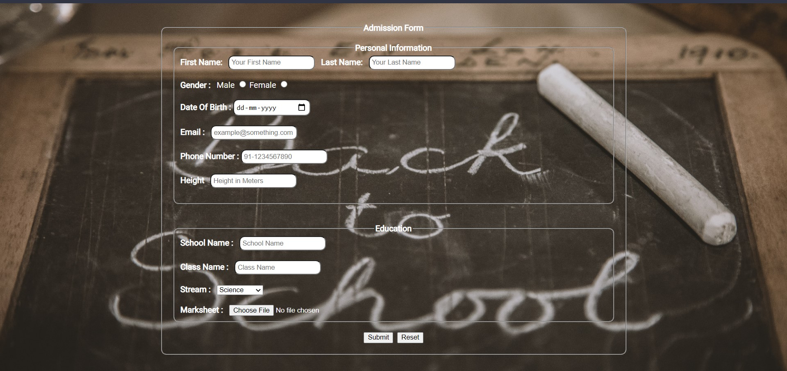

## Table
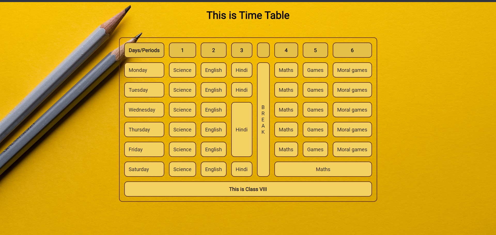


# Assignment2
Phonebook - A contacts directory made using postion sticky.
## Contacts
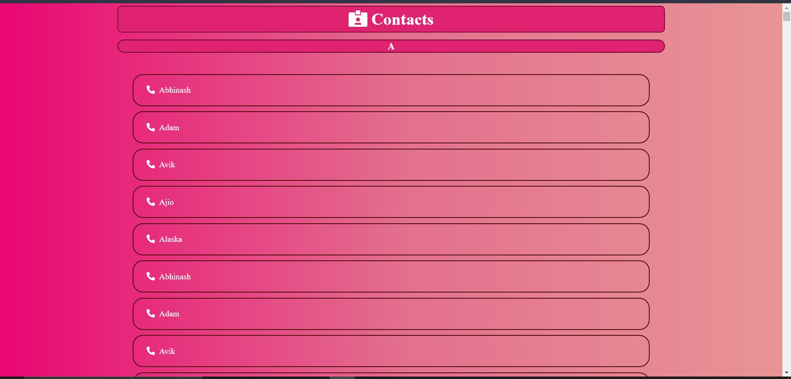

# Assignment 3
Hover Me Button - Translates in y direction , and applies a Shadow

## Hover Me
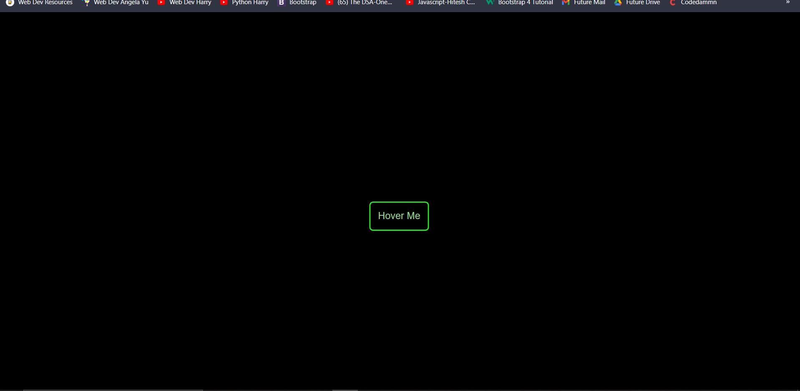

# Assignment 4
Landing Page - A responsive landing page with animations and added responsiveness using CSS Grids and Flexbox

## Landing Page Screenshots


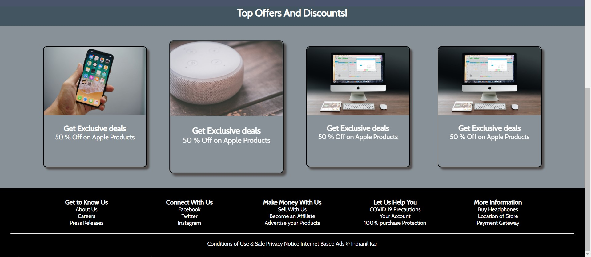

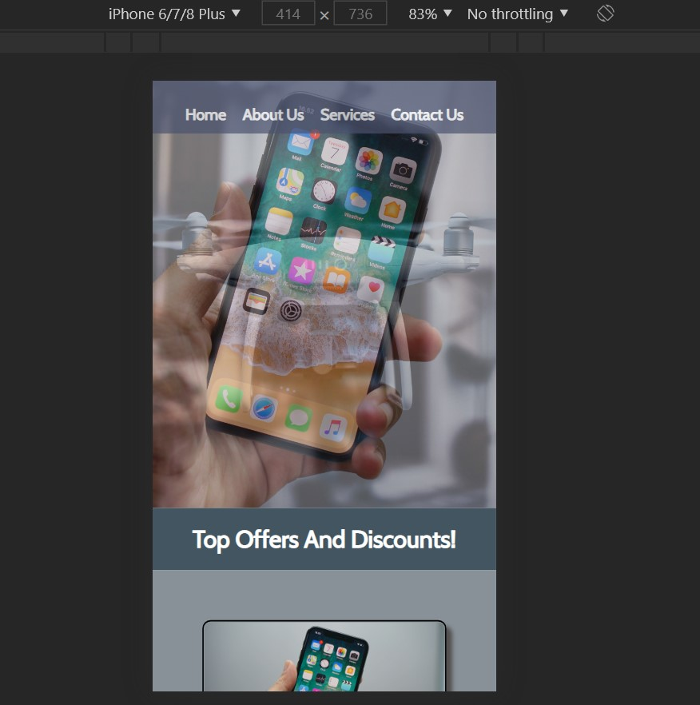

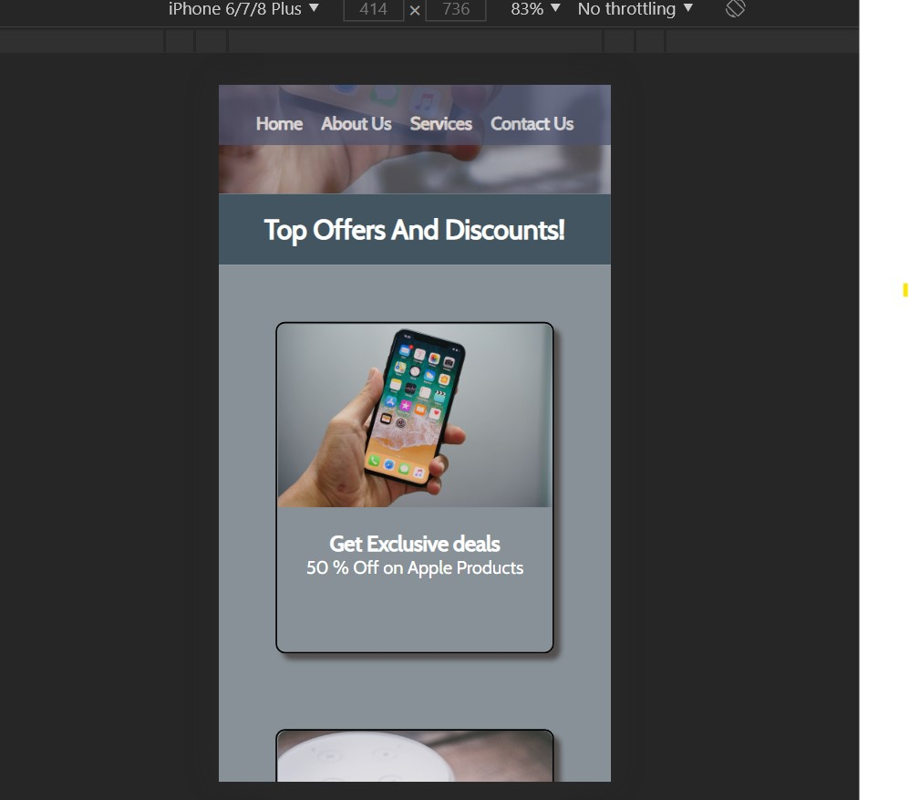

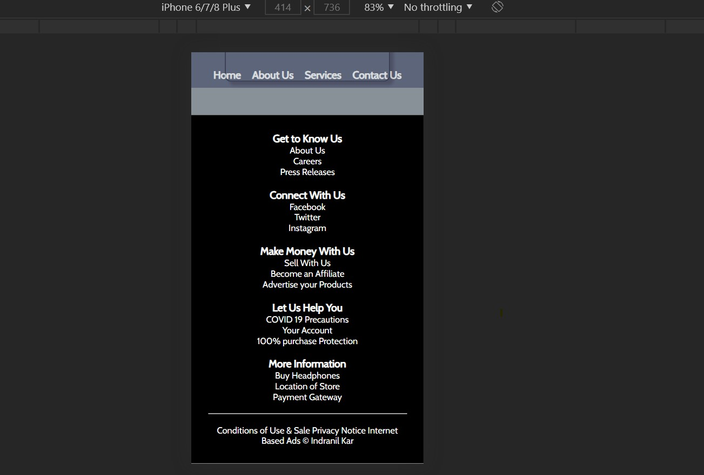

# Assignment 5
Portfolio - It is a personal portfolio project site using Html, Bootstrap Css.

Hosted at - www.indranilkar.ml
## Portfolio Screenshots

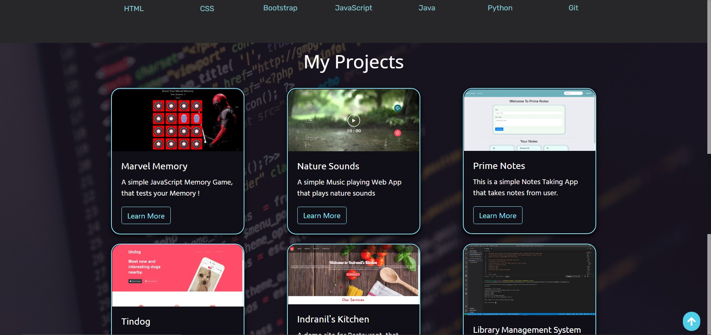


# Assignment 6

Todo List - It is a simple todo list app that where we can add, delete, edit.

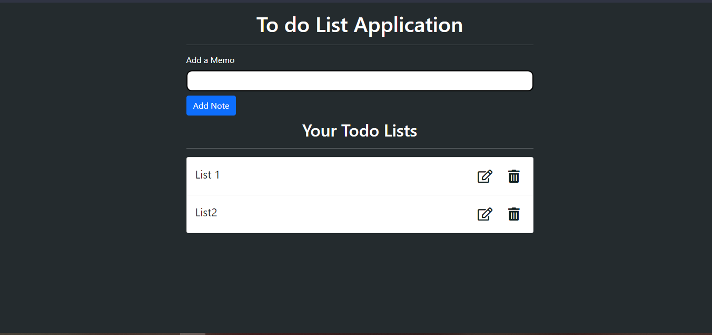

# Assignment 7

Weather App - It is a web app which uses weather api to display the weather of a place. We can search for any place for which we want to see the weather. It also displays a preloader until it loads and When the browser loads up , it fetches the location of the user's device.

Screenshots

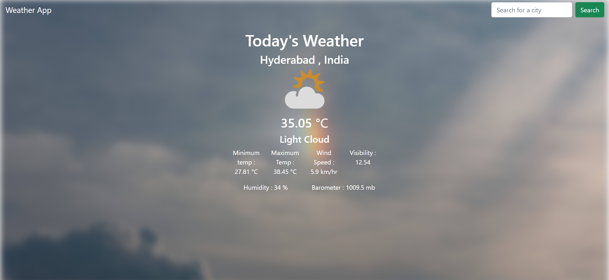

# Assignment 8
Blog App - It is a blog application which has all the blogs in categorical format, and we can perform all the 
basic CRUD operations over there.

## To use - 
* Install NodeJs
* Install mongodb
* Clone the Repo
* Open terminal and write 
 ```node
npm install
```
 And then write in the terminal..

 ```node
 npm start
 ```
 Go to the browser and type<br>

 This is the root route...

 > localhost:3000.<br/>

To display the blogs go to...

 >localhost:3000/blogs

<br>

> There is a seed.js file .To seed  default data into database. Remove the comment of seed() in the index.js file and run the server.
 # Screenshots of the Project
## Blog Home Page- <br/>

 

 ## Individual Page <br/>

 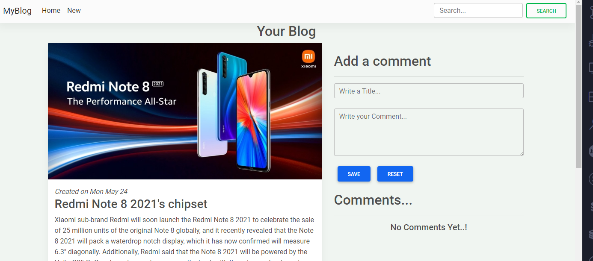

 ## Comment Page <br/>

 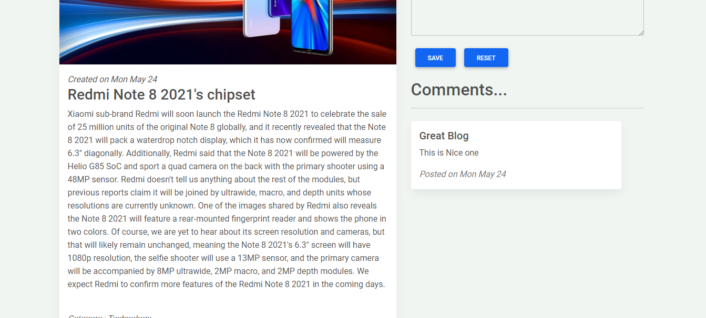

 ## New Page <br/>

 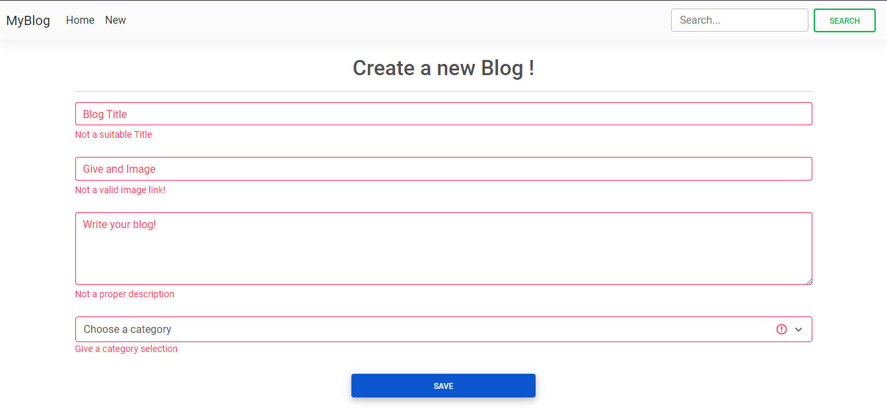

 ## Edit Page <br/>
 
 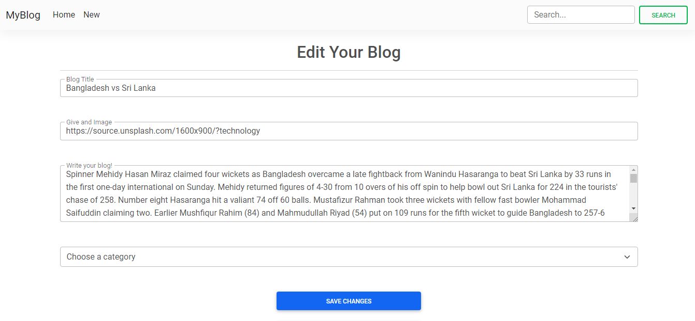
